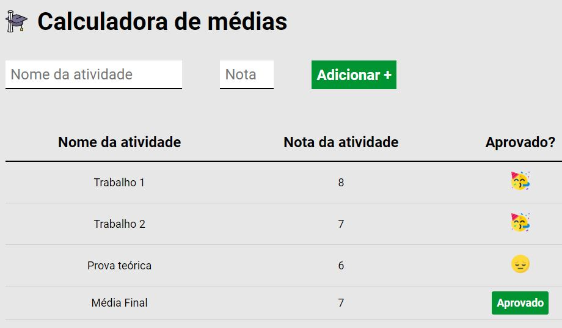

<h1 align="center">🧮 Calculadora Média de Notas 🧮 </h1>

    
  

## Descrição do Projeto

O projeto "Calculadora Média de Notas" foi proposto pela EBAC. É uma calculadora onde o aluno define a nota mínima para aprovação, e em seguida insere suas notas (trabalhos, provas, atividades) para o calculo da média de acordo com a nota mínima, informando se foi aprovado ou reprovado. 

### [Visite o projeto](https://ebac-calculadora-media-notas.vercel.app//)

 

## Tópicos do Projeto

- Inserção do nome e nota através de input e botão 'adicionar'.
- Tabela com 3 colunas e linhas incrementaveis de acordo com os dados inseridos.
- Calculo da média das notas.
- Apresentação do resultado.

 
<h2 align="center"> Desenvolvido por:
</h2>

<h3 align="center"> Renata Ribeiro 

</h3>
  
